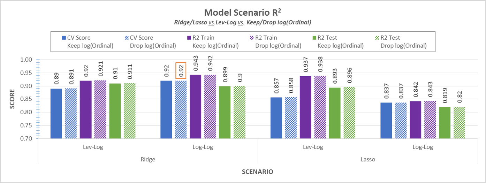

# Project 2: Ames Housing Price Prediction

### Contents:
- [Problem Statement](#Problem-Statement)
- [Executive Summary](#Executive-Summary)
- [Scenario Analysis](#Scenario-Analysis)
- [Conclusions and Recommendations](#Conclusions-and-Recommendations)

### Problem Statement 

Whether it is a decision to buy or sell a home, a crucial piece of information one must know before making such a huge financial decision is how much that home is worth: buyers need to budget the costs they are expecting to incur and weigh their options, while sellers not well-versed in the art of valuation may find it difficult to pin a price tag on their home. That is precisely the issue that potential buyers and sellers of homes in Ames, Iowa are facing and clearly both sides of the market would greatly benefit from an estimate of the value of homes, which leads us to our problem: **How can we predict the price of a home in Ames given that we know quite a bit about the home’s features?**

To answer that question, we have explored a large data set of over 2000 homes and used that insight to build a predictive linear regression model.

### Executive Summary

The main **1_Project-Master-File.ipynb** notebook begins by importing and cleaning a training data set of 2051 homes with 79 different features. Once cleaned, we examine the extent of the correlation between each feature as well as to `SalePrice`, our target variable. While there is bound to be some degree of multicollinearity among features, it is not a major concern as we are building a *predictive* model, not an inferential/interpretable model. We are much more interested in seeing which features have a strong linear relationship with `SalesPrice` as these will be viable candidates to include in our model. It is clear that `OverallQual` has the highest correlation with SalePrice of 0.8, which makes sense as an aggregate metric.

After converting all ordinal categorical features into numerics through a rating map, our model takes all numeric features in the data set (Years and Months converted to nominal categorical variables) and uses one-hot encoding on nominal variables to create dummy variables. This model is then fit using OLS, Ridge, and Lasso regressions (with hyperparameters optimized using Grid Search) and our numeric regressors with an absolute skew of greater than 0.5 have been logged as well to smoothen out the impact of outliers in the data. To decide which model we should settle for, we computed three different scores for each scenario:

* **Mean Cross Validation Score across 5-folds**, which we use as an indicator for how consistent our model predictions are.
* **$R^2$** score for the *training* set
* **$R^2$** score for the *testing* set

We then applied scenario analysis on various models and evaluated them based on these three metrics.

### Scenario Analysis

All metrics measure how well our model captures the variance in the true prices. We have 2 x 2 x 2 = 8 scenarios in total here, which were all possible combinations of:

1. **Regularization Model:**        Ridge vs. Lasso 
2. **Target Variable Form:**        log(`SalesPrice`) vs. `SalePrice`
3. **Dealing with Ordinals with Skew:**        applying log to skewed ordinals vs. keeping skewed ordinals as levels

The log-log scenarios are run in the main **1_Project-Master-File.ipynb** notebook, while the level-log scenarios are run in the **2_Level-Log-Scenarios.ipynb** notebook. Please note that the Master File must be run first as it saves down the cleaned/processed data files which are read into the Level-Log Scenarios notebook to be more memory-efficient.

The scores for all scenarios are shown below:

* We find **Ridge** regularization does better than Lasso in each of their corresponding cross-validation and test cases.
* Theory strongly suggested that a **Log-Log** regression model would be most appropriate given the skewed nature of the `SalesPrice` target variable and certain features such as `Gr Liv Area`. This is especially true for Ridge for all three scores, but not for Lasso where Level-Log did better.
* As for whether or not we should be logging the ordinals, it does not make much sense in theory to apply logarithms to a non-continuous variable so we might not observe the intended smoothening effect. If we look at the difference between each pair of adjacent bars of the same color but different textures in the image above, there is a marginal difference. In almost all of the cases, choosing not to log the ordinals improved scores by 0.001 across all three metrics.

With all of this evidence, our production model was selected to be the Log-Log Ridge regression model which did not take the log of ordinals.

### Conclusions and Recommendations

The ***Log-Log Ridge Regression*** model is able to handle unseen data decently well according to the $R^2$ Test score and Kaggle RMSE so *we have chosen this to be our production model*. It also performs well on a consistent basis judging by the high 5-Fold Cross Validation Score.

There are a number of limitations that the model suffers from however:

1. The model suffers from slight overfitting as the $R^2$ of the Testing Set is 4.2% lower than the Training Set's 
2. Its predictive power is limited by the time frame of homes considered in the data as we were not working with a time series of homes.

In spite of this, we conclude that our model can be used by potential buyers and sellers of homes to predict prices of homes in Ames, IA within a relatively good ballpark of their true values, as long as predictions are for the same time frame considered.

However, many questions are yet to be answered. 

1. Our current model ignores interaction terms because we've already included over 500 regressors. If we were to manually select interaction terms to include in the model would that further improve the predictability of the model?

2. Similarly, would introducing polynomial versions of the top 10 highly correlated features with `SalePrice` into the model improves model predictability?
3. Using the surviving features from Lasso, how well would OLS perform? What ends up being the threshold at which OLS fails?
4. Using time series data, can we predict the price of a specific home at a future time period?